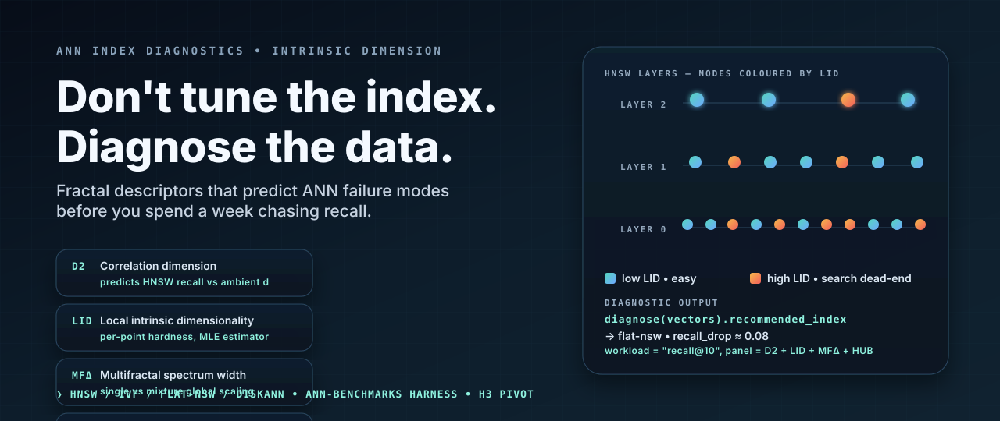

<p align="center">
  
</p>

<h1 align="center">FractalGuard RAG</h1>

<p align="center">
  <strong>Authorization defines the evidence universe. Geometry decides how hard to search it.</strong>
</p>

<p align="center">
  
  
  <a href="https://github.com/mhdk1602/fractal-ann-diagnostics/actions"></a>
  <a href="https://orcid.org/0009-0003-1036-9477"></a>
  
</p>

<p align="center">
  <a href="#the-research-question">Question</a> ·
  <a href="#the-security-contract">Security contract</a> ·
  <a href="#working-reference-system">Run it</a> ·
  <a href="#evidence-and-claim-boundaries">Evidence</a> ·
  <a href="research/preregistration.md">Protocol</a> ·
  <a href="research/literature.md">Sources</a>
</p>

## The research question

Can query-local intrinsic geometry predict failure in policy-constrained approximate retrieval,
and can an adaptive controller meet an authorized-evidence target more cheaply than a cost-matched
static search policy?

This is the AI-governance pivot of the former ANN index recommender. The original project tried to
choose HNSW, IVF, flat NSW, or DiskANN once from global dataset descriptors. That premise was not
supported: no backend recall had been measured, the rules agreed with an HNSW default on only three
of five datasets, angular corpora were measured with Euclidean geometry, and the MFDFA feature was
not invariant to row order.

Version 0.2 changes the decision. Fractal and multiscale measurements are now candidate risk signals
for a live retrieval controller. The observable outcome is exact authorized recall, evidence
sufficiency, abstention, latency, and policy compliance under corpus, embedding, and authorization
drift.

> **Current status:** the authorization plane, exact oracle, HNSW path, query-local geometry,
> counterfactual action replay, rule controller, tests, and synthetic development pilot work. The
> confirmatory corpus study has not run. No paper hypothesis is reported as established.

## The security contract

<p align="center">
  
</p>

The controller cannot grant access.

1. A live deterministic policy decision creates the authorized document universe.
2. Query-local geometry is computed only inside that universe.
3. The controller selects low-effort HNSW, widened HNSW, exact authorized scan, or abstention.
4. A deterministic evidence gate decides whether generation may proceed.
5. Policy version, geometry, action, evidence IDs, fallback reason, and violations enter the audit
   record.

Unknown identity, unavailable policy service, version mismatch, empty grant, or failed evidence
gate produces abstention. The reference HNSW index is physically built over authorized vectors, so
a denied vector cannot enter a learned component by construction.

This ordering follows
[Authorization-First Retrieval](https://aclanthology.org/2026.trustnlp-main.15.pdf),
[NIST SP 800-162 ABAC](https://doi.org/10.6028/NIST.SP.800-162), and
[NIST Zero Trust Architecture](https://doi.org/10.6028/NIST.SP.800-207). The exact threat model is
in [`research/threat-model.md`](research/threat-model.md).

## Working reference system

Install the package and measured HNSW backend:

```bash
python -m pip install -e '.[hnsw,dev]'
```

Create a policy and query the governed path:

```python
import numpy as np

from fractal_ann_diagnostics import AuthorizationPolicy, GovernedRetriever

rng = np.random.default_rng(7)
vectors = rng.normal(size=(1_000, 64)).astype("float32")

# A production adapter would obtain these decisions from live IAM.
visibility = np.zeros((2, len(vectors)), dtype=bool)
visibility[0, :600] = True
visibility[1, 400:] = True
policy = AuthorizationPolicy(
    roles=("analyst", "reviewer"),
    visibility=visibility,
    version="iam-2026-07-13.4",
)

retriever = GovernedRetriever(vectors, policy, role="analyst")
result = retriever.query(
    vectors[17],
    k=10,
    expected_policy_version="iam-2026-07-13.4",
)

print(result.decision.action)
print(result.decision.risk_score)       # transparent development score, not a probability
print(result.search.ids)                # every ID is authorized for analyst
print(result.search.unauthorized_context)  # always 0 on governed paths
```

Run the frozen synthetic development pilot:

```bash
fractal-retrieval-governance pilot --output artifacts/pilot
```

The command writes one row for every query-action counterfactual, aggregate metrics, execution
metadata, and a compact report. The unsafe global comparator is isolated from the public governed
API and exists to verify that violation accounting fires.

### Development pilot snapshot

The fixed-seed run contains 240 query-policy trials and 960 replayed action outcomes. Across the
720 governed action replays, no denied document reached context. The unsafe global comparator
exposed 586 denied chunks in 80 scrambled-policy queries, which confirms that the accounting path
detects a real breach rather than returning a constant zero.

The development controller kept all 80 aligned queries on low-effort HNSW. Under embedding drift,
it widened 56 queries and left 24 at low effort; under policy scrambling, it widened 78 and sent 2
to exact search. These are mechanism checks on synthetic mixtures. They neither establish external
validity nor pass the registered controller gate.

Inspect the [compact report](artifacts/pilot/REPORT.md),
[aggregate JSON](artifacts/pilot/summary.json), or
[query-action records](artifacts/pilot/trials.csv). The report labels `efSearch` as an effort proxy;
it is not a count of distance evaluations.

## What is implemented

| Capability | State | Evidence |
|---|---|---|
| Versioned role authorization masks | Working | Policy, unknown-role, immutability, and churn tests |
| Exact authorized top-k | Working | Masked metric-aware oracle |
| Authorization-first HNSW | Working | Real `hnswlib` backend over the permitted subset |
| Euclidean and cosine retrieval | Working | Metric-conformance tests; angular corpora no longer use Euclidean geometry |
| Query LID and cross-scale instability | Working | Computed after authorization; denied-vector perturbation test |
| Relative contrast and radius expansion | Working | Query-local authorized-universe features |
| Fail-closed rule controller | Working | Low/high HNSW, exact scan, policy failure, version mismatch, abstention |
| Counterfactual action matrix | Working | Every action replayed against exact authorized truth |
| MFDFA distance-sequence feature | Retired | Row permutation changed its value; API returns `NaN` with a warning |
| Multi-corpus confirmatory study | Registered | Not yet run |
| Learned cost-sensitive controller | Planned | Requires sealed calibration split |
| Answer faithfulness and extraction evaluation | Planned | Requires annotated evidence and model stage |

## Evidence and claim boundaries

The project sits after four bodies of work, not before them.

### Authorization already exists

[Permission-Aware RAG](https://doi.org/10.1109/ACCESS.2025.3628960) performs real-time IAM
validation across heterogeneous resources. Authorization-First Retrieval formalizes the ordering
invariant and reports leakage from retrieve-then-filter baselines. This project does not claim to be
the first authorization-aware RAG system.

### Filtered and adaptive ANN already exist

[Filtered-DiskANN](https://doi.org/10.1145/3543507.3583552) and
[ACORN](https://doi.org/10.1145/3654923) search predicate-constrained graphs.
[Global-Local Selectivity](https://arxiv.org/abs/2602.11443) measures vector-filter correlation,
and [Ada-ef](https://doi.org/10.1145/3786639) assigns HNSW effort per query.
[Fiber-Navigable Search](https://arxiv.org/abs/2604.00102) already connects local geometry to
filtered-graph failure regimes.

The open test is their conjunction with deterministic IAM, exact authorized evidence truth,
counterfactual controller evaluation, and drift.

### Geometry is both diagnostic and adversarial

LID and relative contrast distinguish ANN query difficulty
([Aumüller and Ceccarello, 2021](https://doi.org/10.1016/j.is.2021.101807)); hubness describes skew
in reverse-neighbor occurrence
([Radovanović et al., 2010](https://jmlr.org/papers/v11/radovanovic10a.html)). Yet geometry can also
aid RAG corpus reconstruction: [GeoEx](https://openreview.net/forum?id=x61zDYEZ91) treats embedding
structure as an offensive signal.

### Retrieval exposure reaches the model

[Qi et al.](https://proceedings.iclr.cc/paper_files/paper/2025/file/79cafa874121a3435d8a54f454b646b4-Paper-Conference.pdf)
extract private RAG material through prompt injection.
[LeakDojo](https://doi.org/10.18653/v1/2026.findings-acl.287) shows that leakage changes across
attacks, models, and datasets. The policy boundary must therefore precede the model; output
filtering is too late.

The full source-to-claim ledger is in [`research/literature.md`](research/literature.md).

## Registered gates

The word “fractal” remains in the eventual paper title only if geometry improves held-out log loss,
Brier score, and AUPRC over a policy-and-system model across at least four of five sealed corpora.

The adaptive-control claim requires a lower evidence-policy violation rate than the best
cost-matched static action, with fixed coverage, compute, latency, and zero entitlement violations.
Success must reproduce separately under corpus, embedding, and policy drift.

If those gates fail, the release becomes a policy-aware retrieval benchmark and negative descriptor
study. The [`preregistration`](research/preregistration.md) specifies the estimands, data tiers,
actions, splits, uncertainty, ablations, and null interpretations before sealed evaluation.

## Repository map

```text
fractal-ann-diagnostics/
├── src/fractal_ann_diagnostics/
│   ├── policy.py          # deterministic authorization and policy churn
│   ├── retrieval.py       # exact, global HNSW, and authorization-first HNSW
│   ├── geometry.py        # query LID, contrast, radius expansion, multiscale stability
│   ├── controller.py      # fail-closed action selection
│   ├── evaluation.py      # exact recall, evidence policy, counterfactual records
│   ├── synthetic.py       # fixed geometry/policy/drift development scenarios
│   ├── pilot.py           # replay and artifact generation
│   ├── cli.py             # `fractal-retrieval-governance`
│   ├── descriptors.py     # corrected legacy corpus descriptors
│   └── diagnostic.py      # preserved, explicitly uncalibrated v0.1 API
├── research/
│   ├── preregistration.md
│   ├── threat-model.md
│   ├── literature.md
│   └── paper/outline.md
├── experiments/
│   └── run_governance_pilot.py
├── artifacts/pilot/      # compact synthetic development evidence
├── tests/
└── .github/workflows/ci.yml
```

## Reproducibility

- Python 3.10–3.14 is tested in CI.
- Routine CI runs metric, policy, geometry, controller, backend, and pilot-smoke tests.
- Large corpora, indexes, embeddings, traces, and model weights stay outside Git.
- Confirmatory inputs will use versioned manifests, licenses, revisions, and SHA-256 hashes.
- Every action is replayed for every trial, so controller regret is measured from observed outcomes.
- Pilot results remain separate from sealed confirmation.

## Integrity record

The v0.1 index-selection experiment remains in Git as a falsified precursor. Its 3/5 result compared
handwritten rules with a handwritten practitioner default; it did not measure index-selection
regret. The old MFDFA statistic is retained only as a deprecated API that returns `NaN`.

That correction is part of the contribution. The project now has an observable policy outcome,
exact counterfactual truth, and a place for a clean null result.

## Citation and license

Sole author: [mhdk1602](https://github.com/mhdk1602),
[ORCID 0009-0003-1036-9477](https://orcid.org/0009-0003-1036-9477).

Citation metadata is in [`CITATION.cff`](CITATION.cff). Code is released under the
[`MIT License`](LICENSE).
