<p align="center">
  
</p>

<h1 align="center">FractalGuard RAG</h1>

<p align="center">
  <strong>Authorization defines the searchable universe. Multiscale geometry prices the effort required inside it.</strong>
</p>

<p align="center">
  
  
  <a href="https://github.com/mhdk1602/fractal-ann-diagnostics/actions"></a>
  <a href="https://orcid.org/0009-0003-1036-9477"></a>
  
</p>

<p align="center">
  <a href="#the-question">Question</a> ·
  <a href="#security-contract">Security</a> ·
  <a href="#the-line-between-a-pilot-and-a-finding">Confirmation</a> ·
  <a href="#run-the-reference-path">Run it</a> ·
  <a href="https://github.com/mhdk1602/fractal-ann-diagnostics/blob/master/research/preregistration.md">Draft protocol</a> ·
  <a href="https://github.com/mhdk1602/fractal-ann-diagnostics/blob/master/research/study-manifest.json">Study lock</a>
</p>

## The question

Can query-local multiscale geometry add held-out predictive information about an intent-to-treat
low-effort action-failure outcome beyond system, policy, and probe-telemetry variables? If it can,
can a frozen controller reduce the equal-corpus mean of family-level relative end-to-end request
latency without materially reducing authorized retrieval target attainment or complete-evidence
sufficiency?

The low-effort action fails when `hnsw-low` does not complete or when a completed action has
authorized recall below 0.90. This is a service-and-retrieval composite, not a pure ANN-recall label.
An empty authorized universe remains a valid governed no-result service outcome and is not excluded.

That is the v0.3 confirmatory question to be registered. It is narrower than “safe RAG.” The
primary study ends at the controlled retrieval boundary. It does not test answer correctness,
entailment, faithfulness, or prompt-based extraction.

> **Scientific status:** the apparatus, closed protocol schema, real-corpus adapters, label
> separation, request-bound policy path, frozen model specifications, family-clustered inference,
> an event-yield sensitivity simulator, fresh pre-run artifact admission, detached action-panel
> provenance, pinned-binary timelock encryption, process-local label withholding, and a
> provider-claimed no-rescue execution lineage are implemented. Public benchmark labels remain
> accessible outside the apparatus; this design does not establish human outcome blindness or
> independent organizational custody. The manifest is still a draft, the prospective external
> registration has not been published, and the five-corpus sealed study has not run. A
> [Zenodo record and DOI are reserved](research/zenodo-reservation.json), but the draft is deliberately
> unpublished until the exact C1 bytes exist. The repository
> contains no confirmatory finding yet.

The workflow source names two GitHub environments: `confirmatory-rehearsal` for candidate execution
and `confirmatory` for production publication, attestations, claims, and execution. Those names do
not prove that repository protection rules exist. Before C0/C1 freeze, the live environment
configuration and its API readback must be retained with the apparatus evidence. Under the current
sole-operator ownership, an approval recorded by `mhdk1602` is self-approval. It creates an
auditable manual pause, but it is not independent review, separation of duties, or independent
custody. Enabling prevention of self-review without another eligible reviewer would make the
registered execution inoperable rather than independent.
The production image workflow authenticates the live REST capture. The
[offline environment-control verifier](research/github-environment-control.md) admits that exact
two-environment readback and records its evidentiary limit without holding credentials or changing
GitHub state; C0 and C1 bind the canonical receipt file hash.

## Security contract

<p align="center">
  
</p>

The controller cannot grant access. The governed path enforces this order:

1. The policy decision point receives subject, action, finite environment data, and the exact
   document-universe digest.
2. A fresh nonce and request digest bind the response to that call and to a pinned policy-bundle
   revision. The built-in remote OPA transport requires HTTPS plus a bearer credential,
   and it rejects redirects.
3. Exact and HNSW indexes are built from authorized vector rows only.
4. A bounded HNSW probe supplies LID at k=50, cross-scale LID variation, relative contrast, and
   radius expansion. Probe latency and work are system telemetry, not geometry.
5. The frozen controller selects `hnsw-low`, `hnsw-high`, `exact-authorized`, or `abstain`.
6. A second fresh policy decision rechecks every returned ID immediately before emission.

Unknown identity, malformed policy data, replay, policy outage, version drift, corpus mismatch,
empty grant, or final-mask change yields abstention. Exact and HNSW access remain inside the same
authorized slice.

Authorization is point-of-emission. A downstream process that retains an ID or document after a
later revocation must reauthorize at its own disclosure boundary. See the full
[threat model](https://github.com/mhdk1602/fractal-ann-diagnostics/blob/master/research/threat-model.md).

The boundary follows the retrieval ordering in
[Authorization-First Retrieval](https://aclanthology.org/2026.trustnlp-main.15/), the attribute
model in [NIST SP 800-162](https://doi.org/10.6028/NIST.SP.800-162), and the resource-access rule in
[NIST SP 800-207](https://doi.org/10.6028/NIST.SP.800-207). The
[evidence ledger](https://github.com/mhdk1602/fractal-ann-diagnostics/blob/master/research/literature.md)
records what each source supports and where it stops.

## The line between a pilot and a finding

| Evidence level | What exists now | What it can support |
|---|---|---|
| Synthetic mechanism check | Fixed-seed mixtures, policy scrambling, embedding drift, every pilot search strategy replayed | Code-path behavior and accounting checks |
| Engineering conformance | Authorized-only indexes, fresh final authorization, OPA behavior tests, artifact hashing, label isolation, audit chain | A testable security and execution contract |
| Draft confirmatory protocol | Closed schema, draft manifest, action set, estimands, receipt types, and explicit freeze blockers | Prospective design only; it cannot authorize sealed access |
| Externally registered frozen protocol | Not yet created | A confirmatory study only after every `tbd` is resolved, the artifacts are admitted, and the frozen digest is publicly registered |
| Confirmatory evidence | Not run | Only the sole admissible provider-claimed lineage can produce this |

The draft manifest deliberately fails frozen validation. It records the unresolved work rather than
hiding it:

- acquire and hash the five fixed corpus inputs, separately held labels, and corpus-specific policy
  workloads;
- pin five timelock ciphertexts, the exact drand chain and round, Linux ARM64 `tle`, separate
  release-image digest, custody builder, and custody-seal receipt; disclose common administrative
  control and public label availability;
- publish the
  [label-payload-excluded development selection receipt](research/development-cohort.md), which
  ranks qrel-derived assignment components without opening qrel or evidence payloads, then pin its
  fit/calibration materialization, the connected query-partition audit, and the power report;
- pin the embedding, backends, OPA bundle, controller, comparator, fitted models, and analysis
  runner;
- estimate nuisance parameters on development data, run the event-yield sensitivity grid and the
  endpoint-specific joint-gate simulation, then lock the maximum required family count;
- provision a custodian, a distinct online runner, fixed hardware, a digest-pinned image, and an
  externally administered result anchor;
- replace the explicit `production_workloads: unresolved-before-c1` sentinel with the five complete
  fixed-order WorkloadSpec objects and their canonical newline-terminated file hashes;
- change status to `frozen`, write the manifest digest lock, then open the sealed run once.

This is the practical answer to “how do synthetic mechanism results become confirmatory?” The
apparatus and decision rules must stop changing before sealed execution and scoring, including the
registered join between anchored action rows and label payloads. The result must be allowed to fail
every prespecified gate. That process order does not show that an operator was unaware of publicly
accessible benchmark labels.

## Apparatus lifecycle

The freeze has two Git commits with different jobs. C0 fixes the executable apparatus. Heavy
artifact construction happens from that exact commit under schemas that exclude the sealed label
artifacts from those process inputs. C1 is then a direct child of C0 whose only changed files are
the frozen manifest, its digest lock, and the consumed candidate-to-C1 transition receipt.
Some cohort identities are inherited from a partition graph constructed earlier from qrels.
Component digests enter deterministic stage allocation for SciFact, MIRACL transfer, BRIGHT, and
the HotpotQA FullWiki training split; HotpotQA development questions are fixed to sealed. A
different positive-qrel graph can therefore change component identity, rank, and assigned stage.
The downstream receipts exclude qrel payloads, but they do not make that upstream construction
label-independent.

```mermaid
flowchart LR
    C0["C0 apparatus commit"] --> IMG["Digest-pinned OCI image"]
    C0 --> EMB["Pinned paired-Qwen embedding build"]
    EMB --> DEV["Development selection and paired execution"]
    DEV --> ART["Policies, indexes, models, and power evidence"]
    IMG --> C0REL["Immutable C0 evidence release"]
    C0REL --> C1["C1 witnessed freeze"]
    EMB --> C1
    ART --> C1
    C1 --> REG["GitHub attestations and public Zenodo record"]
    REG --> OPEN["OPENED"]
    OPEN --> RUN["One claimed suite; five corpus workloads"]
    RUN --> ONLINE["ONLINE_COMPLETE and external anchor"]
    ONLINE --> LABELS["Timed label release"]
    LABELS --> SCORE["One declared analysis"]
    SCORE --> FINAL["ANALYSIS_COMPLETE"]
```



The operator contracts are split by responsibility:

| Boundary | Primary specification |
|---|---|
| Development-family selection and paired measurements | [development cohort](research/development-cohort.md), [development execution](research/development-execution.md) |
| Embedding, policy, index, model, and power artifacts | [embedding store](research/embedding-store.md), [artifact pipeline](research/artifact-pipeline.md), [freeze package](research/freeze-package.md) |
| Outcome-blind candidate source composition | [candidate source composer](research/candidate-study-manifest-composer.md), [candidate manifest assembly](research/candidate-manifest-assembly.md) |
| Image and process identity | [runner image](research/runner-image.md), [runtime attestation](research/runtime-attestation.md) |
| Durable C0 evidence and C1 release binding | [runner image](research/runner-image.md), [external anchors](research/external-anchors.md) |
| Provider CAS state and no-rescue phase lineage | [suite attempt](research/suite-attempt.md), [GitHub state attestation](research/github-state-attestation.md), [provider-plan construction](research/provider-plan-operator.md), [runner registration and activation](research/provider-runner-activation.md), [provider phase workflows](research/provider-phase-workflows.md) |
| Ciphertext custody and release | [label custody](research/label-custody.md), [external anchors](research/external-anchors.md) |
| Post-label persisted input and sole analysis | [input operator](research/confirmatory-input-operator.md), [confirmatory execution](research/confirmatory-execution.md) |
| Prespecified estimands and decision gates | [preregistration](research/preregistration.md) |

Passing one boundary never implies that the next occurred. C0 is not C1, registration is not
execution, a completed online suite is not label release, and an analysis result is not externally
attested until the final ledger transition verifies.

## Prespecified claim and gates

The exact primary claim lives in both
[`study.py`](https://github.com/mhdk1602/fractal-ann-diagnostics/blob/master/src/fractal_ann_diagnostics/study.py)
and the
[`study manifest`](https://github.com/mhdk1602/fractal-ann-diagnostics/blob/master/research/study-manifest.json).
Validation rejects textual drift between them.

H1 is a descriptive orientation diagnostic: it asks whether the frozen model assigns greater risk
to the frozen high-geometry profile than to the low-geometry profile. It does not use sealed labels
and has no role in primary success. The primary claim is the H2 and H3 intersection:

- the H2 equal-corpus directional lower bounds for log-loss reduction, Brier-score reduction, and
  AUPRC gain for `full` over `system-policy` each exceed their frozen thresholds, and the
  corpus-specific point rule passes on at least four of five corpora. `system-policy` includes probe
  latency and work; `full` adds only LID at k=50, LID-CV, relative contrast, and radius expansion;
- the lower directional 95% family-bootstrap bound for the equal-corpus mean of family-level
  relative end-to-end request-latency reductions exceeds 10%;
- retrieval target attainment is noninferior within one percentage point;
- complete-evidence sufficiency is noninferior within one percentage point on SciFact, HotpotQA
  FullWiki, and T2-RAGBench;
- the upper directional 95% bound for the equal-corpus mean of within-corpus proposed-to-comparator
  p95 ratios of family-mean end-to-end request latency is below 1.25;
- emitted entitlement violations equal zero, accompanied by a family-level exact upper bound.

All five corpora use exact authorized top-k as the primary ANN-fidelity reference. BRIGHT and the
fixed MIRACL transfer slice also supply relevance judgments for secondary IR reporting, but they do
not supply complete evidence bundles and therefore do not enter the complete-evidence gate.

## Run the reference path

Install the measured HNSW backend and development dependencies:

```bash
python -m pip install -e '.[hnsw,dev]'
```

Query an immutable policy snapshot:

```python
import numpy as np

from fractal_ann_diagnostics import (
    AuthorizationPolicy,
    GovernedRetriever,
    policy_document_universe_sha256,
)

rng = np.random.default_rng(7)
vectors = rng.normal(size=(1_000, 64)).astype("float32")

visibility = np.zeros((2, len(vectors)), dtype=bool)
visibility[0, :600] = True
visibility[1, 400:] = True

document_universe_sha256 = policy_document_universe_sha256(
    f"synthetic-document-{document_id}|embedding-seed-7"
    for document_id in range(len(vectors))
)

policy = AuthorizationPolicy(
    roles=("analyst", "reviewer"),
    visibility=visibility,
    version="iam-2026-07-13.4",
    document_universe_sha256=document_universe_sha256,
)

retriever = GovernedRetriever(
    vectors,
    policy,
    role="analyst",
    expected_document_universe_sha256=document_universe_sha256,
)
result = retriever.query(
    vectors[17],
    k=10,
    expected_policy_version="iam-2026-07-13.4",
    environment={"tenant": "research"},
)

print(result.decision.action)
print(result.search.ids if result.search is not None else "abstain")
print(result.total_online_latency_ms)
```

For a live OPA decision point, query the bundled Rego rule through the OPA Data API and use
`OpenPolicyAgentDecisionPoint`. Its constructor requires the ordered document-universe digest and
the expected policy-bundle revision. The adapter denies malformed, stale, oversized, redirected,
unbound, or unavailable responses.

Run the synthetic development pilot:

```bash
fractal-retrieval-governance pilot --output artifacts/pilot
```

Validate the draft protocol and print its canonical digest:

```bash
fractal-retrieval-governance validate-study \
  --manifest research/study-manifest.json

fractal-retrieval-governance study-digest \
  --manifest research/study-manifest.json
```

`--require-frozen` must fail while blockers remain. Once a reviewed frozen manifest has been
registered in an independently administered registry, the pinned runner verifies that
registration, the manifest lock, and every local artifact before it can open the digest-derived
run receipt:

```bash
fractal-retrieval-governance verify-study-artifacts \
  --manifest /approved/study-manifest.json \
  --artifact-root /approved/artifacts \
  --artifact-map /approved/artifact-map.json \
  --receipt /approved/artifact-verification.json

fractal-retrieval-governance begin-sealed-run \
  --manifest /approved/study-manifest.json \
  --lock /approved/study-manifest.sha256 \
  --artifact-verification-receipt /approved/artifact-verification.json \
  --artifact-root /approved/artifacts \
  --artifact-map /approved/artifact-map.json \
  --protocol-registration-receipt /approved/protocol-registration.json \
  --protocol-registration-record /approved/protocol-registration-record.json \
  --registration-package /approved/confirmatory-c1-registration \
  --runner-identity github-actions:environment:confirmatory
```

Receipt parents must already exist and contain no symlink in their paths. The local map cannot
override a manifest digest. The production `begin-sealed-run` command requires the artifact root and
map again. It rereads every local artifact immediately before opening and requires the fresh
verification receipt bytes to equal the previously admitted receipt. A stored verification receipt
alone cannot authorize the run.

The local registration record and receipt are canonical JSON followed by one newline. They are
pointers, not admission authority. Immediately before opening the run, the CLI revalidates the exact
27-file C1 package, both retained GitHub attestations, fixed Zenodo record `21361837`, and every file
through its anonymous public-content URI. The public bytes, local package, registry record, and
receipt must agree. The run receipt records both prerequisite receipt digests and URIs, and the
command refuses a second opening. This networked preflight occurs before the runner enters the
network-disabled execution environment.

After prediction anchoring and offline label admission, the sealed scorer calls
`run_confirmatory_analysis_once`, not the repeatable analysis core. The built-in path accepts only a
canonical local `file:` results directory. It first creates a manifest-derived analysis-attempt
receipt with exclusive `O_EXCL` semantics, before the H1 orientation diagnostic or H2–H3
confirmatory-gate computation. That receipt binds
the manifest, run receipt, joined-input digest, model-suite digest, runner identity, and intended
result URI. A prior attempt blocks computation. A failed process leaves the attempt receipt in
place. After a result is computed, a detached result receipt binds its digest to the admitted
attempt and is created before the canonical result file. All three paths are derived from the
manifest digest; none is selected by the caller.

## What is implemented

| Contract | Implementation | Adversarial check |
|---|---|---|
| Request-bound authorization | In-memory PDP and HTTPS OPA adapter | wrong subject/action/environment/corpus, stale nonce, outage, malformed response |
| Strict read boundary | Authorized-only exact and HNSW indexes | denied-row access trap and paired-world perturbation |
| Bounded online geometry | HNSW probe at prespecified scales | finite telemetry, fixed `probe_k`, no offline exact scan in serving path |
| Measured request cost | authorization, refresh, probe, feature, controller, selected search, wall time | non-overlap and total-time checks |
| Evidence truth | alternative complete bundles with URI, locator, and content hash | wrong query, wrong source, stale hash, partial route, unretrieved evidence |
| Corpus normalization | SciFact, separate-corpus HotpotQA FullWiki, T2-RAGBench, qrels export for BRIGHT/MIRACL | candidate leakage, unknown IDs, bad locators, conflicting documents |
| Label withholding | opaque HMAC keys, disjoint online/plaintext/ciphertext artifacts, manifest-pinned Linux ARM64 `tle`, a provider-claimed release phase after online completion, and process-local input gates | altered ciphertext, moving round, unpinned binary, plaintext mounted by the online process, pre-claim input access, or joined labels that differ from admitted bytes |
| Action-panel admission | typed governed and failed outcomes plus a detached receipt for controller decisions, policy decisions, audit-chain position, failure timing, and query-partition binding | caller-supplied IDs, missing or duplicate actions, decision drift, audit mismatch, invented failure output |
| Frozen modeling | four logistic specifications and prespecified LID×instability interaction | feature order, category drift, partition overlap, artifact digest |
| Confirmatory inference | equal-corpus paired family bootstrap, exact zero-event bound, pre-compute attempt receipt, and detached result receipt | pair-key mismatch, single-family strata, repeated attempt, result or receipt substitution |
| Design sensitivity | beta-binomial event-yield sensitivity plus a required endpoint-specific joint-gate simulation | deterministic grids, coverage checks, and a maximum required family count |
| Study integrity | closed manifest, external protocol registration, exact artifact cardinalities, fresh local byte revalidation, no-follow traversal, exclusive local run receipt, and provider CAS claims | extras, omissions, symlinks, hard links, post-verification mutation, wrong runner or manifest, or an alternate provider lineage |
| Audit | HMAC subject pseudonym, request bindings, component revisions, evidence hashes, chained records | tamper, reorder, delete, truncate, denied-evidence forgery |

The audit chain and exclusive receipt need a trusted external head or write-once store. Local hashes
cannot protect against an actor who can rewrite both the evidence and its anchor.

## Corpus contract

| Corpus | Prespecified use | Evidence status | Guardrail |
|---|---|---|---|
| SciFact | scientific claim retrieval | alternative rationale bundles | rationale sentence IDs must resolve against pinned abstracts |
| HotpotQA FullWiki | multi-hop retrieval | one joint supporting-fact bundle | supplied per-question contexts are rejected for sealed retrieval |
| T2-RAGBench | financial table-and-text retrieval | source-context bundle | repeated contexts are deduplicated by pinned context ID |
| BRIGHT | difficult domain retrieval | qrels only | qrels never masquerade as complete evidence |
| MIRACL transfer slice | multilingual transfer | qrels only | language, split, and source export must be pinned before freeze |

Source-input bytes, canonical online-execution bytes, label bytes, and timelock ciphertexts occupy
separate manifest roles for every corpus. The online artifact contains query text, documents, and opaque keys. It
contains no source query IDs, family IDs, answers, relevance judgments, evidence bundles, or
label-bearing metadata. Offline scoring joins predictions and labels only after an external anchor
records a canonical prediction-completion receipt with the exact typed action-panel binding. The
scorer loads the actual custody file through `load_sealed_label_artifact`; the analysis input then
recomputes its canonical digest against the manifest pin and compares every joined label object with
that admitted payload. A bare in-memory prediction object, reconstructed label object, or copied
digest string cannot release labels into the primary analysis.

The [custody protocol](https://github.com/mhdk1602/fractal-ann-diagnostics/blob/master/research/label-custody.md)
defines the pinned-binary encryption command, drand round rule, online artifact whitelist, release
predicate, and proof limits. Timelock encryption supplies a time condition, not evidence that the
custodian is independent or that no other plaintext copy exists.

## Statistical contract

- The five corpora are fixed strata. The analysis makes a suite-conditional claim.
- Query family is the independent resampling unit. Nested policies, actions, seeds, and drift rows
  stay attached to their family.
- Corpora receive equal weight. They are never bootstrap-resampled.
- Proposed and comparator rows require exact pair-key agreement.
- Primary intervals are directional one-sided 95% bounds. The two endpoints returned by the helper
  are separate directional bounds, not a two-sided 95% interval.
- The draft contract fixes 10,000 paired bootstrap replicates and base seed `20260713`.
- `nested_rows_per_family` is a frozen trial-design cardinality for policy draws, seeds, drift rows,
  or timing repeats. It is not a power-model parameter.
- Relative request-latency reduction is computed within family before corpus aggregation.
- The beta-binomial common-shock simulator measures low-effort action-success event yield only. It
  does not establish 90% power for the H2+H3 conjunction.
- Freeze requires a pinned endpoint-specific joint-gate simulation for H2 and every H3 gate. The
  registered family count is the maximum requirement across those endpoints and the joint decision.

The [draft preregistration](https://github.com/mhdk1602/fractal-ann-diagnostics/blob/master/research/preregistration.md)
specifies the H1 orientation diagnostic,
the H2–H3 primary gates, exclusions, gatekeeping, and null interpretations. The
[execution protocol](https://github.com/mhdk1602/fractal-ann-diagnostics/blob/master/research/confirmatory-execution.md)
assigns the
custodian, runner, and reviewer roles. Neither document is evidence that external registration has
already occurred.

## Repository map

```text
fractal-ann-diagnostics/
├── src/fractal_ann_diagnostics/
│   ├── policy.py / policy_adapters.py       # request-bound authorization
│   ├── retrieval.py / geometry.py           # authorized search and bounded diagnostics
│   ├── controller.py / online_runner.py     # frozen decisions and paired online actions
│   ├── study_data.py / query_cohort.py      # five-corpus staging and family selection
│   ├── development_execution.py             # label-payload-excluded fit/calibration measurements
│   ├── embedding_store.py                   # current and stale Qwen vector stores
│   ├── compiled_policy.py                   # exact OPA mask catalogs
│   ├── authorized_index_store.py            # policy-specific HNSW stores
│   ├── artifact_pipeline.py                 # deterministic C1 artifact compiler
│   ├── runtime_attestation.py               # live Linux process and mount evidence
│   ├── production_workload_registration.py  # public five-workload C1 contract
│   ├── production_controls.py                # blueprint, closed C1 inputs, and atomic finalizer
│   ├── production_corpus_run.py             # config-only sealed corpus entrypoint
│   ├── suite_attempt.py                     # externally attested suite state machine
│   ├── custody.py / timelock_release.py     # ciphertext creation and gated release
│   ├── confirmatory_analysis.py             # H1 diagnostic and H2–H3 gates
│   ├── confirmatory_input_operator.py       # persisted post-label input and sole analysis
│   ├── confirmatory_execution.py            # single analysis attempt and result custody
│   ├── freeze_package.py                    # closed manifest-to-filesystem layout
│   ├── zenodo_publication.py                # guarded C1 deposit and public verification
│   └── study.py                             # closed protocol and artifact cardinalities
├── examples/
│   ├── opa_authorization.rego                # request-time policy contract
│   └── opa_compiled_masks.rego               # offline bulk-mask contract
├── operators/
│   └── candidate_study_manifest_composer.py   # exact typed evidence-to-source join
├── research/
│   ├── study-manifest.json                   # draft C1 lock, 79 typed artifacts at freeze
│   ├── candidate-study-manifest-composer.md  # closed pre-provider source boundary
│   ├── preregistration.md                    # estimands, gates, exclusions, nulls
│   ├── confirmatory-execution.md             # role-separated operator sequence
│   ├── confirmatory-input-operator.md        # LABELS_RELEASED to ANALYSIS_COMPLETE
│   ├── suite-attempt.md                      # four externally attested transitions
│   ├── label-custody.md                      # timed release and claim boundary
│   └── literature.md                         # source-by-source evidence limits
├── .github/workflows/
│   ├── ci.yml
│   ├── confirmatory-image.yml
│   ├── confirmatory-c0-evidence-release.yml
│   ├── confirmatory-registration-attestation.yml
│   └── confirmatory-state-attestation.yml
├── Dockerfile.confirmatory
├── artifacts/pilot/             # synthetic development evidence only
└── tests/                        # unit, hostile-input, and contract checks
```

## Scientific lineage

The v0.1 project tried to recommend an ANN index from global descriptors. That result did not
measure backend recall, mixed angular data with Euclidean geometry, and used an MFDFA statistic that
changed under row permutation. The current compatibility function warns and returns `NaN`.

v0.2 moved the experiment to query-local control inside an authorized universe. v0.3 adds controls
that exclude sealed label payloads from the pre-release processes and bind protocol decisions
before scoring. It does not establish human label ignorance: the benchmark labels remain publicly
accessible, and the partition components are partly qrel-derived. The original negative result
remains in Git because it explains why the research question changed.

The [evidence ledger](https://github.com/mhdk1602/fractal-ann-diagnostics/blob/master/research/literature.md)
states what each source may support and where its
authority ends. The project sits after authorization-first retrieval, filtered ANN, adaptive
`efSearch`, query-difficulty measurement, and RAG extraction research. The untested conjunction is
the proposed contribution.

## Reproducibility and release discipline

- CI tests Python 3.10–3.14, builds and installs the wheel, validates the study manifest, verifies a
  checksum-pinned OPA binary, and runs Rego behavior tests.
- GitHub actions are pinned to immutable commit SHAs.
- Large corpora, embeddings, indexes, model weights, private keys, and sealed outputs stay outside
  Git.
- Every frozen input, label set, normalizer, model, backend, policy workload, controller, runner,
  image, development split, partition audit, power report, and source revision receives a manifest
  role and digest.
- Each plaintext label, timelock ciphertext, exact `tle` executable, custody builder, and custody
  seal receives a distinct manifest role and digest.
- Development, calibration, and sealed families cannot cross partitions.
- A technical failure preserves its run, action-panel admission, analysis-attempt, detached-result,
  and partial artifact evidence. A failed admitted analysis ends v0.3. Confirmatory reserve release
  is forbidden; another attempt requires an amended protocol version and a new external registration.

## Citation and license

Sole author: [mhdk1602](https://github.com/mhdk1602),
[ORCID 0009-0003-1036-9477](https://orcid.org/0009-0003-1036-9477).

Citation metadata is in
[`CITATION.cff`](https://github.com/mhdk1602/fractal-ann-diagnostics/blob/master/CITATION.cff).
Code is released under the
[`MIT License`](https://github.com/mhdk1602/fractal-ann-diagnostics/blob/master/LICENSE).
