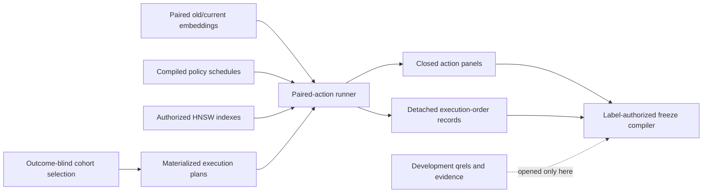

# Outcome-blind development paired execution

## Purpose

[`development_execution.py`](../src/fractal_ann_diagnostics/development_execution.py) is the only
admitted bridge between the label-free development cohort and the label-authorized freeze
compiler. It executes every registered retrieval action before development qrels or evidence are
opened. The result is a closed paired-action panel, not a fitted model or a scientific result.

The runner fixes five things before execution:

- the 200 fit and 75 calibration query families per corpus;
- three registered authorization strata per family;
- both embedding epochs;
- the four action treatments; and
- the actual treatment order for every trial.

It then measures the action outcomes. Latency is an observed quantity and is not expected to
reproduce bit-for-bit. Trial identities, action membership, action order, source bindings, feature
schema, and output membership are deterministic.



## Fixed execution denominator

The execution plan has the following exact cardinalities:

| Partition | Families per corpus | Trials per family | Corpora | Trials | Action rows |
|---|---:|---:|---:|---:|---:|
| fit | 200 | 3 | 5 | 3,000 | 12,000 |
| calibration | 75 | 3 | 5 | 1,125 | 4,500 |
| total | 275 | 3 | 5 | 4,125 | 16,500 |

Each trial runs `hnsw-low`, `hnsw-high`, `exact-authorized`, and `abstain`. The published JSONL
stores those four rows in canonical registered-action order so downstream parsing is invariant to
runtime treatment order. A separate `execution-order.json` records the actual order.

The actual order is generated with seed `20260714` and
`sha256-ranked-family-latin-square-v1`. It is a deterministic, family-balanced permutation. The
validator recomputes every permutation from the execution-plan digest and rejects caller-supplied
orders.

## Source receipt chain

The runner accepts one canonical, closed config with ten inputs, one for each corpus and
development stage. Each input names exact policy-intervention and authorized-index receipts. The
top-level config names the materialization receipt. Before an action panel can be published, the
runner proves this chain:

```text
selection receipt
  -> materialization receipt
     -> execution plan
     -> paired embedding receipt
        -> policy config + mask catalog + policy schedule + policy receipt
           -> authorized-index receipt
              -> action panel + execution-order record
```

The policy schedule, policy receipt, authorized-index receipt, embedding receipt, and materialized
plan must agree on the execution-plan digest, corpus, stage, document universe, row order, mask
catalog, and policy revision. The detached order must match the canonical policy schedule row for
row. Recomputing a receipt after substituting one source does not satisfy these cross-bindings.

Paths are canonical absolute POSIX paths. The config rejects roots that overlap one another and
rejects path components associated with a sealed, held-out, custody, or reserve boundary. There is
no generic source role through which a label file can be introduced.

## Retrieval semantics

For each trial, the old query and old document matrices define the active ANN epoch. The current
query and current document matrices define exact truth. The runner admits both matrices through
the same paired-embedding receipt and verifies their query and document row orders.

The four actions have distinct roles:

| Action | Search path | Purpose |
|---|---|---|
| `hnsw-low` | authorized old-epoch HNSW index, `ef=128` | treatment and model-feature row |
| `hnsw-high` | authorized old-epoch HNSW index, `ef=512` | static comparator |
| `exact-authorized` | authorized current-epoch vectors | exact paired truth |
| `abstain` | no search | registered non-retrieval control |

Authorization masks are prepared before timing and the authorized-index cache is sealed. Each
retrieval still passes through the governed retriever. An action aborts publication if it returns
an unauthorized row. Returned rows must be unique nonnegative integers, cannot exceed registered
`k=10`, and must be empty for a failed or abstained action. The exact action must complete; the
abstain action must carry `registered-abstention`.

Only `hnsw-low` carries model covariates. Its object must contain exactly the registered feature
schema. Corpus size, authorized-universe size, embedding dimension, version lag, target allow rate,
and dual-epoch query drift are derived from pinned sources. Geometry telemetry comes from the
retrieval call. An undeclared field or nonfinite number is an error.

## Development policy decision point

The development runner uses the production `OpenPolicyAgentMaskDecisionPoint` request and response
validator with an in-process transport backed by the canonical compiled OPA data table. The
transport implements one exact lookup by `(subject, policy_state)` and returns only the registered
mask identifier, digest, and count. It does not return document identifiers. Unknown assignments
receive a 404 response.

This transport removes network and sidecar availability from the development measurement while
retaining the OPA wire contract. It is not the production deployment claim. Confirmatory online
execution uses the separately attested loopback OPA sidecar and its runtime boundary.

## Published package

The output root must not exist. The runner writes a private sibling staging directory, flushes the
files, and publishes with an operating-system no-replace rename.

```text
execution-config.json
execution-receipt.json
development-fit/
  <corpus>/
    paired-actions.jsonl
    execution-order.json
development-calibration/
  <corpus>/
    paired-actions.jsonl
    execution-order.json
```

The receipt pins all 20 stratum artifacts plus the config, source receipts, row counts, family
counts, and trial counts. Verification rejects missing files, extra files, symbolic links, hard
links, special files, noncanonical JSON, changed bytes, duplicate rows, omitted actions, changed
orders, and stale source receipts.

No qrel or evidence byte appears in this package. Online materialization verification runs with
`verify_label_payloads=False`. The handoff command builds a closed freeze-compiler config from the
execution receipt and materialization receipt; the freeze compiler is the first component allowed
to open development qrels and evidence.

## Operator commands

Write the canonical config with
`DevelopmentPairedExecutionConfig.canonical_file_bytes()`. Hand-formatted JSON is rejected.

Run all ten strata:

```bash
fractal-development-execution run \
  --config /controlled/development/paired-execution-config.json
```

Verify the published package and rebind it to every source receipt:

```bash
fractal-development-execution verify \
  --root /controlled/development/paired-execution-v1 \
  --receipt-sha256 <execution-receipt-sha256>
```

Create the only admitted freeze-compiler config:

```bash
fractal-development-execution write-freeze-config \
  --execution-root /controlled/development/paired-execution-v1 \
  --config-output /controlled/development/development-freeze-config.json \
  --output-root /controlled/development/freeze-v1
```

Each command writes one canonical result object to stdout. Validation errors return a nonzero
status. None of the commands replaces an existing output.

## Resource envelope

The runner processes the ten strata sequentially. It memory-maps the two document matrices and two
query matrices for the active stratum, then opens one verified authorized index at a time. It does
not retain all corpora in memory. Peak resident memory therefore depends on the HNSW backend,
operating-system page cache, embedding dimension, and active corpus, not on the sum of all five
corpora.

The registered workload contains 16,500 action calls. Every non-abstain call includes governed
authorization and retrieval; every `exact-authorized` call scans the current-epoch authorized
subset. Wall time is corpus- and hardware-dependent. Record the measured wall time, peak RSS,
storage reads, backend version, CPU model, and thread settings during the dry run. Do not infer the
confirmatory runtime envelope from a unit-test fixture.

The runner should stop before publication when any of these conditions occurs:

- fewer or more than 200 fit or 75 calibration families in a corpus;
- any missing, repeated, or fourth trial within a family;
- a receipt or document-universe mismatch;
- an unavailable or mutable authorized index;
- a nonfinite vector, zero-norm query, or row-order mismatch;
- an incomplete exact control or an authorization violation;
- an unregistered action, feature, output, or filesystem entry; or
- a label-bearing path crossing the outcome-blind boundary.

After a successful dry run, an independent reviewer should verify the receipt chain, reproduce the
deterministic execution orders, inspect resource telemetry, and confirm that the freeze config is
derived by `write-freeze-config` rather than assembled by hand.
